# IROBOT

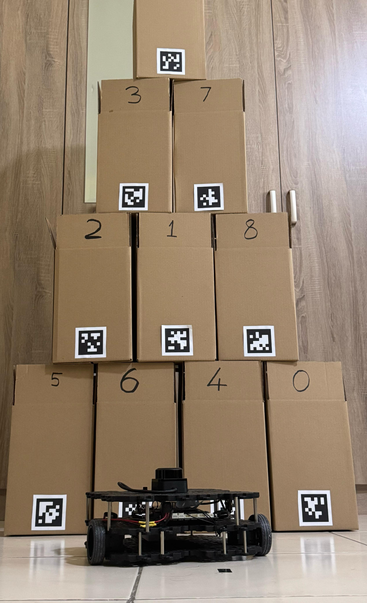

*Empowering Robots for Seamless Inventory Management in Small to Medium Warehouses*


Built with the tools and technologies:


---

## 📑 Table of Contents

- [📌 Overview](#-overview)
- [📽️ Demo / How It Works](#-Demo--How-It-Works)
- [🚀 Getting Started](#-getting-started)
  - [Prerequisites](#prerequisites)
  - [Installation](#installation)
  - [Conda Environment Setup](#conda-environment-setup)
  - [Usage](#usage)
  - [Testing](#testing)
- [📁 Additional](#Additional)
- [🙏 Acknowledgments](#acknowledgments)

---

## 📌 Overview


**IROBOT** is an autonomous warehouse inventory management system developed as part of a final year project at Heriot-Watt University. Designed for small to medium-sized warehouse environments, the system uses a ROS 2-powered TurtleBot3 Waffle Pi to autonomously navigate, scan, and monitor inventory shelves.

The robot identifies items using AprilTags, detects missing or unknown items, and updates this data in real-time to a user-friendly web interface built with Taipy. The system integrates key robotics and data technologies such as SLAM for mapping, Nav2 for navigation, MongoDB for inventory storage, and OpenCV for perception tasks.

🎓 University: Heriot-Watt University  
👨‍🏫 Supervisor: Dr. Nidhal Abdulaziz  
👨‍💻 Student: Mohammed Ibrahim


---

## 📽️ Demo / How It Works

### 🔹 Test Case 1 – Identifying 9 Known Items
[](https://youtu.be/vr4dMc1UE1U?si=JOIPj0qWZc1x-HAi)

- Demonstrates scanning a fully stocked shelf with 9 known items.
- Verifies AprilTag detection and inventory logging.

### 🔹 Test Case 2 – Handling 2 Missing Items, 4 Unknowns, and 3 Known Items
[](https://youtu.be/_uMRsMMcNog?si=caOtP-Oy-F5uPxns)

- Detects shelf with mixed inventory (known, unknown, and missing items).
- Robot receives command via the Taipy Web UI and moves to the target shelf.
- Demonstrates full integration of navigation, detection, and web control.

---

## 🚀 Getting Started

## Prerequisites


| Component              | Specification                      |
|------------------------|------------------------------------|
| Robot Base             | TurtleBot3 Waffle Pi               |
| Processor              | Raspberry Pi 4 (4GB+ recommended)  |
| Camera                 | Raspberry Pi Camera Module v2      |
| LiDAR                  | RPLIDAR C1 or compatible           |
| Storage                | 64GB Class 10 microSD Card         |


---

## Installation


#### 📦 On Raspberry Pi (Robot Side)

1. **Flash Ubuntu Server to SD Card**  
   - Use [Raspberry Pi Imager](https://www.raspberrypi.com/software/)  
   - Select **Ubuntu 22.04 Server** and enable SSH in advanced options.

2. **Install ROS 2 Humble (Minimal)**  
 - Follow the [ROS 2 Humble Installation Guide](https://docs.ros.org/en/humble/Installation/Ubuntu-Install-Debians.html)
     
   ```bash
   sudo apt update && sudo apt upgrade -y
   sudo apt install -y ros-humble-ros-base
   ```
     
3. **Set Up ROS 2 Workspace**
   
   ```bash
   mkdir -p ~/ros2_ws/src
   cd ~/ros2_ws
   colcon build
   source install/setup.bash
   ```

5. **Clone Required Packages**
 - RPLIDAR: [ros2 branch](https://github.com/Slamtec/rplidar_ros/tree/ros2)
 - TurtleBot3: [humble branch](https://github.com/ROBOTIS-GIT/turtlebot3/tree/humble)
   
   ```bash
   cd ~/ros2_ws/src
   git clone -b ros2 --single-branch https://github.com/Slamtec/rplidar_ros.git
   git clone -b humble --single-branch https://github.com/ROBOTIS-GIT/turtlebot3.git
   ```
6. **Create and Configure the camera_pub Package**
 - ssh into the Pi
    
   ```bash
    cd ~/ros2_ws/src
    ros2 pkg create --build-type ament_python camera_pub --dependencies rclpy sensor_msgs
    cd camera_pub/camera_pub
    touch camera_pub.py
    chmod +x camera_pub.py
    ```
 - Open the newly created camera_pub.py located at:

   ```bash
     nano ~/ros2_ws/src/turtlebot3/turtlebot3_bringup/launch
    ```
  - Edit the appropriate launch file (robot.launch.py) to include your camera_pub node.
  - Replace the robot.py with the contents of modified_files/robot.py from this repository.
  - Add the node in the setup_file.py
    
7. **Modify the TurtleBot3 Bringup Launch**

 - Open the launch directory:
   
   ```bash
     nano ~/ros2_ws/src/camera_pub/camera_pub/camera_pub.py
    ```
   
 8. **Build and Source**
    
      ```bash
      cd ~/ros2_ws
      colcon build
      source install/setup.bash
      ```
 9. **Check Camera Node***
     
      ```bash
      ros2 run irobot camera_pub camera_pub 
      ```
---

#### 💻 On Laptop (Navigation/Control Side)

1. **Install ROS 2 Humble (Desktop Full)**
   
   ```bash
   sudo apt update
   sudo apt install ros-humble-desktop
   ```

3. **Set Up IROBOT Workspace**
   
   ```bash
   mkdir -p ~/irobot_ws/src
   cd ~/irobot_ws
   colcon build
   source install/setup.bash
   ```

5. **Clone Required Packages**
   
- TurtleBot3: [humble branch](https://github.com/ROBOTIS-GIT/turtlebot3/tree/humble)
- IRobot: [main branch](https://github.com/Faheemibrahim/IRobot.git)

  ```bash
   cd ~/ros2_ws/src
   git clone -b ros2 --https://github.com/ROBOTIS-GIT/turtlebot3/tree/humble
   git clone -b humble --https://github.com/Faheemibrahim/IRobot.git
   ```

7. **Packages to install**

   Install Navigation2 (Nav2)
   
   ```bash
   sudo apt install ros-humble-navigation2
   sudo apt install ros-humble-nav2-bringup
   ```
   
   Install OpenCV Bridge
   
   ```bash
   sudo apt install -y ros-humble-cv-bridge ros-humble-image-transport
   ```

 9. **Build and Source**
    
     ```bash
     cd ~/irobot
     colcon build
     source install/setup.bash
     ```

 10. Conda Environment Setup

  - Create a Python environment for AprilTag detection and image processing:

    ```bash
    conda create -n irobot_env python=3.10
    conda activate irobot_env
    conda install -c conda-forge pupil-apriltags opencv
    ```

> **Note:** This is used by perception subprocess script


---

## Usage

1. **Mapping**
 - On the Robot:
 - Launch the TurtleBot3 bringup:

   ```bash
   ros2 launch turtlebot3_bringup robot.launch.py
   ```
 - On the Laptop  
 - Launch Cartographer (SLAM):
   
   ```bash
   ros2 launch turtlebot3_cartographer cartographer.launch.py use_sim_time:=false
   ```

 - Control the Robot via Keyboard: In a new terminal:
   
   ```bash
   ros2 run turtlebot3_teleop teleop_keyboard
   ```
 - Start Mapping: Use the arrow keys to move the robot around and build the map.

   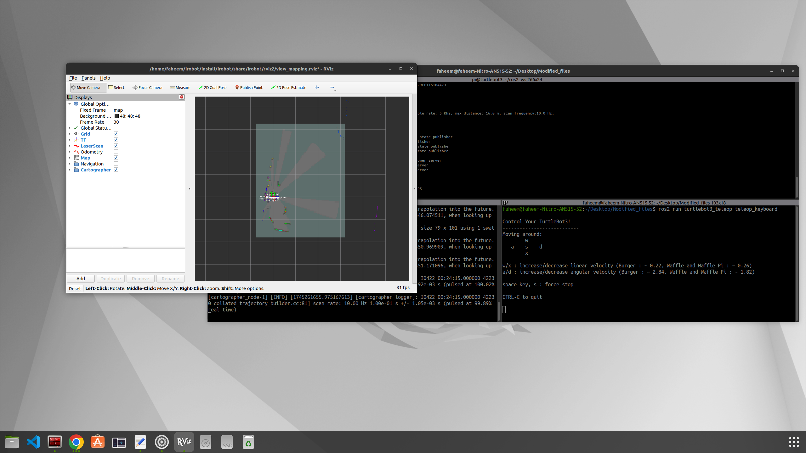
  
 - Save the Map Once Done: Once you're satisfied with the generated map:

   ```bash
   ros2 run nav2_map_server map_saver_cli -f ~/ros2_ws/src/irobot/maps/custom_map_name
   ```

> **Note:** This will create a map.pgm and map.yaml in ~/ros2_ws/src/irobot/custom_map_name.
   


2. **Waypoints**
 - On the Laptop
 - Open your ROS 2 workspace in VS Code:
 - Locate the map loading section in your custom launch file (slam_navigation.launch.py) under the irobot package:
 - Replace the map.yaml with the name of your custom map file if you've saved it with a different name (warehouse_map.yaml).
   
 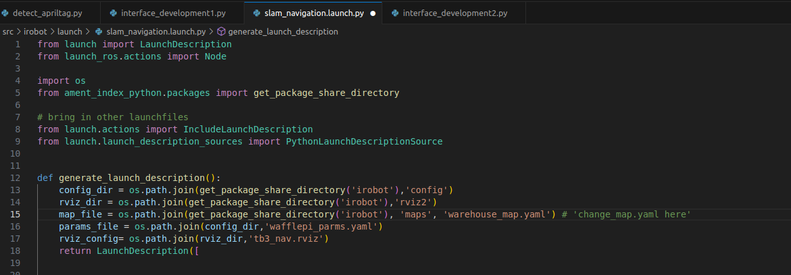

 - build and source

    ```bash
    colcon build
    source install/setup.bash
    ```
 - Start your custom launch file (which loads the map and brings up the Nav2 stack):

    ```bash
    ros2 launch irobot slam_navigation.launch.py
    ```
 - In RViz, use the 2D Nav Goal tool to navigate the robot to different locations.
 - Mark each location as a waypoint.
   
 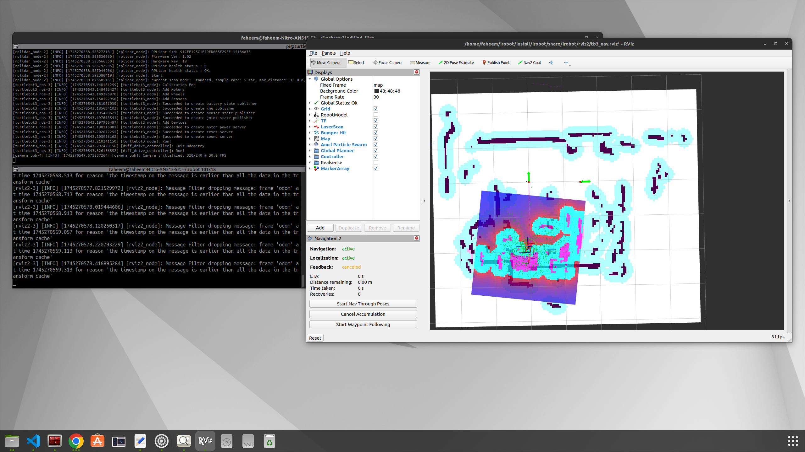

 - Open a new terminal tab, source the workspace, and echo the /waypoints topic:
 - Note down the x and y coordinates for each waypoint. You’ll use these later for navigating through waypoints.
 
    ```bash
    source ~/ros2_ws/install/setup.bash
    ros2 topic echo /waypoints
    ```
 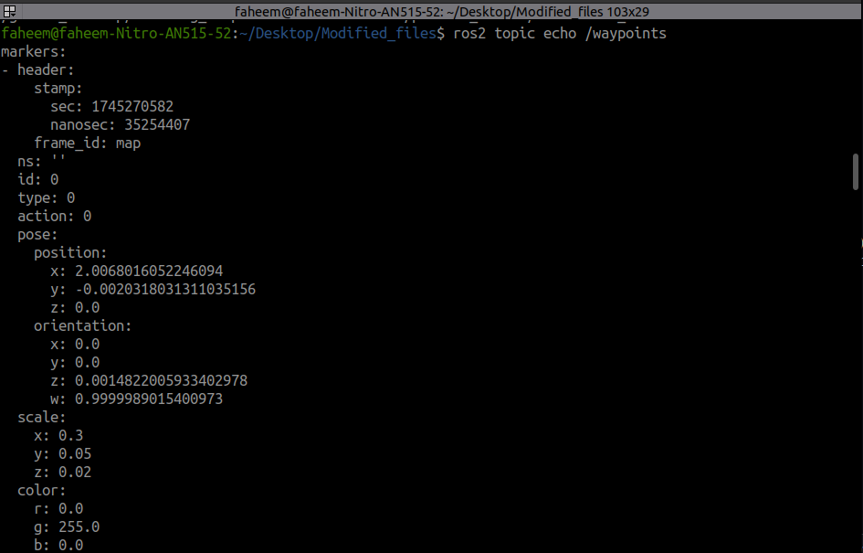
 

3.**Start Inventory Management Process**
 - On the Robot:
 - Launch the TurtleBot3 bringup:

   ```bash
   ros2 launch turtlebot3_bringup robot.launch.py
   ```
 - On the Laptop
  
 - Launch the Web Interface
 - In separate terminals, run the sender and receiver scripts:

   ```bash
   # Terminal 1
   python3 ~/IRobot/src/other_files/sender.py

   # Terminal 2
   python3 ~/IRobot/src/other_files/receiver.py
   ```
 
 - Open VS Code and edit the waypoints dictionary to set the correct (x, y) values for your warehouse shelves:
 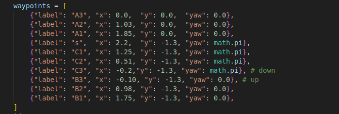

 - build and source

    ```bash
    colcon build
    source install/setup.bash
    ```
    
- Start Nav2 Server:

    ```bash
    ros2 launch irobot slam_navigation.launch.py
    ```
  
- Start Inventory Scanning

    ```bash
    ros2 launch irobot inventory_scan.launch.py
    ```
4. **Build Custom AprilTag**
 
 - Open the AprilTag generator source file in VS Code:

    ```bash
    code ~/IRobot/src/other_files/generate_apriltags/Generate36h11.java
    ```
   
 - Modify the Number of Tags: Locate the for loop and change the loop count to generate the desired number of tags.

 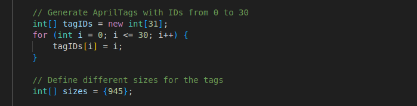
   
 - Change Tag Size: Update the image dimensions.
 - To print AprilTags at an accurate physical size, you need to convert the dimensions from centimeters (cm) to pixels (px) based on the print resolution.

   ```bash
   Pixels = (cm / 2.54) × DPI
   Pixels = (cm / 2.54) × 300
   int imageSize = 945;  // 8 cm at 300 DPI
   ```
 - Compile and Build to Generate Tags
   
   ```bash
   # Compile all Java files and output to the 'build/' directory
   javac -d build/ $(find src -name "*.java")

   # Run the AprilTag generator
   java -cp build/ april.tag.Generate36h11
   ```
  
 
 -  The generated AprilTags will be saved in: ~/IRobot/src/other_files/generate_apriltags/generated_tags/size_1888px/
   
 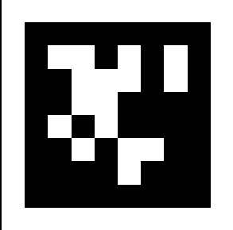

---

### 📁 Additional
1. The taipy_modules directory contains different modular components of the full web interface before it was integrated into the final receiver.py application. These modules represent standalone UI elements used for development, testing, and individual experimentation.
   
 - Buttons: Manual control panel with buttons for navigating the robot to predefined points (BASE, P1–P9).

 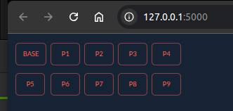

 - Display_picture: Displays saved images from the database.
 
 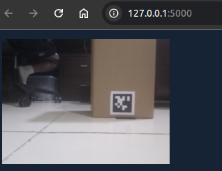

 - Menu – navigation menu used for switching between dashboard pages and views.
 
 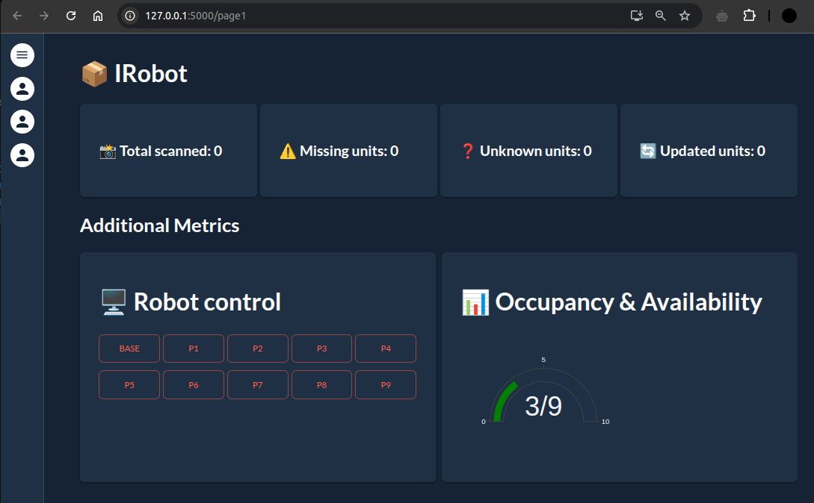

 - Metric: Gauge to mesure how many inventories are done 
 
 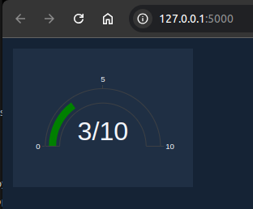
 
 - Tabular_data – Table that displays scanned inventory data including tag IDs, product info, and timestamps.
 
 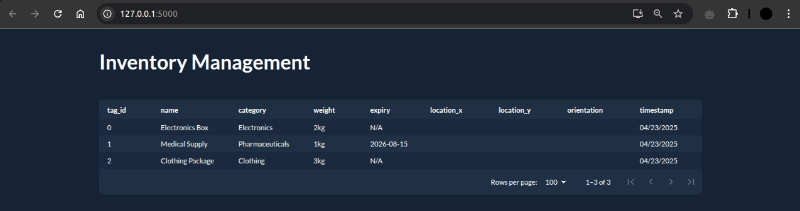

---

### 🙏 Acknowledgments(Credits & Licensing)

This project builds upon the work of several open-source communities and tools. Special thanks to the developers and maintainers of the following resources, which were instrumental to this project:

- **[ROBOTIS](https://www.robotis.com/)** – for TurtleBot3 hardware, software packages, and documentation  
- **[ROS 2 Navigation Stack (Nav2)]([https://navigation.ros.org/](https://docs.nav2.org/))** – for autonomous navigation and path planning  
- **[Open Robotics](https://www.openrobotics.org/)** – for their contributions to the ROS ecosystem  
- **[Pupil Labs AprilTags](https://github.com/pupil-labs/apriltags)** – for the AprilTags library used in visual inventory tracking
- **[Google Cartographer]([https://google-cartographer-ros.readthedocs.io/](https://ros2-industrial-workshop.readthedocs.io/en/latest/_source/navigation/ROS2-Cartographer.html))** – for real-time SLAM capabilities    
- **[Taipy](https://www.taipy.io/)** – for providing workflow orchestration tools and documentation  
- **Other open-source packages and documentation** referenced during development  

Your contributions have made this work possible — thank you!

If you discover any external code, files, or assets in this repository that do not clearly indicate licensing information, please contact me at **mi200@hw.ac.uk**. I will ensure proper attribution or removal as necessary.


---

